Bug-01: Cookie Consent Banner Persistence Issue
Severity: Minor

Feature: Global UI / Cookie Management

Description:
The "Cookie Usage Confirmation" banner (Cookie Policy) remains visible on the screen even after the user clicks the "Accept" or "Confirm" button. The banner fails to disappear, obstructing part of the viewport for the duration of the session.

Steps to Reproduce:
Navigate to www.keflahayot.co.il.

Wait for the Cookie Consent banner to appear (usually at the bottom or center).

Click the confirmation button ("מאשר").

Navigate to another page or refresh the current page.

Actual Result:
The banner remains displayed in the DOM and visible to the user, regardless of the confirmation action.

Expected Result:
Upon clicking the confirmation button, the banner should be dismissed (removed from the DOM or hidden via CSS) and its state should be saved (e.g., in LocalStorage or Cookies) so it doesn't reappear during the same session.

Visual Evidence:
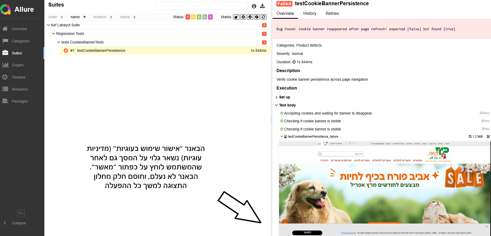

***

bug-02: Element Overlap - "My Orders" Button Obstructed
Severity: Critical

Feature: Header / Navigation Menu

Description:
The "My Orders" button in the header is mostly by the "Select Language" dropdown menu. This overlap prevents the user from clicking the button, effectively blocking access to order history.

Steps to Reproduce:

Navigate to the homepage www.keflahayot.co.il.

Look at the top header section where the user menu and language selector are located.

Attempt to click on "ההזמנות שלי".

Actual Result:
The "Select Language" element occupies the same visual space as the "My Orders" button, intercepting the click events.

Expected Result:
Each header element should have its own dedicated space without overlapping. The "Select Language" dropdown should be positioned so that it does not obstruct functional navigation buttons.

Visual Evidence:
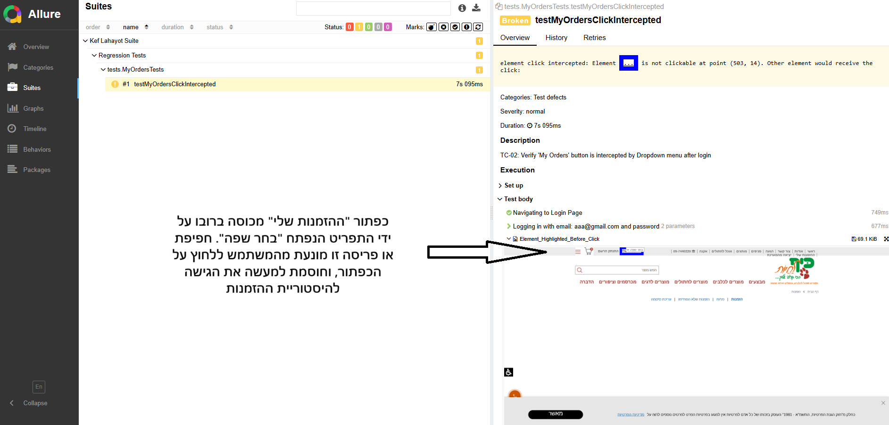

***

bug - 03: Canceled

***

Bug-04: Redundant Logout Options in User Menu
Severity: Trivial

Feature: User Account / UI Consistency

Description:
After logging in, the user menu displays two different buttons for the same action: "התנתק" (Disconnect) and "יציאה מהמערכת" (Exit System). Having two distinct labels for the same functional endpoint creates unnecessary clutter and inconsistency in the UI.

Steps to Reproduce:

Log in to the website www.keflahayot.co.il.

Open the user profile / account menu.

Observe the logout options.

Actual Result:
The menu contains two separate buttons that perform the exact same logout function.

Expected Result:
The UI should be consistent. Only one logout option should be present, using a single, clear label (e.g., "יציאה מהמערכת").

Visual Evidence:
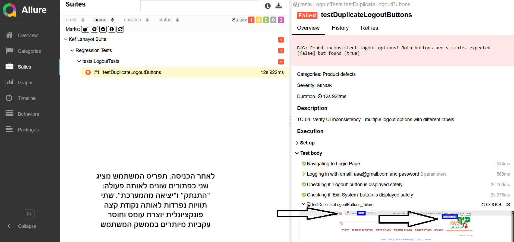

***

Bug-05: UI Overlap - "Register" Button Obstructs Term Confirmation Text
Severity: Normal

Feature: Registration Page

Description:
On the registration page, the "Register" (הרשמה) button is incorrectly positioned, causing it to overlap with the mandatory "Terms and Conditions" checkbox and its associated text. This layout issue partially hides the legal disclaimer: "* אני מאשר/ת שקראתי ואני מסכימ/ה לתקנון".

Steps to Reproduce:

Navigate to the Registration page: https://www.keflahayot.co.il/register.

Scroll down to the bottom of the registration form.

Observe the vertical alignment of the "Register" button and the checkbox below it.

Actual Result:
The button's positioning causes it to sit on top of the checkbox text, making the legal confirmation difficult to read and interact with.

Expected Result:
There should be sufficient padding/margin between the registration form fields and the submission button to ensure all legal disclaimers and checkboxes are fully visible and clickable.

Visual Evidence:
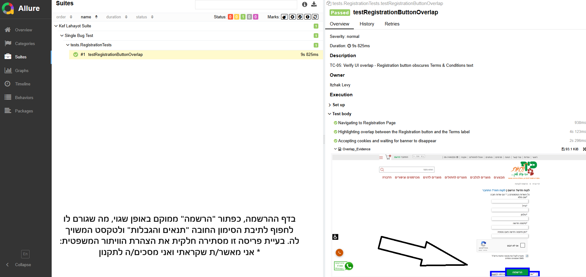

***

Bug-06: Critical Logic Bypass - Registration Allowed Without Terms Agreement
Severity: Blocker

Feature: Registration / Security & Compliance

Description:
The registration form fails to validate the mandatory "Terms and Conditions" checkbox. A user can successfully create a new account even if the checkbox ("* אני מאשר/ת שקראתי ואני מסכימ/ה לתקנון") remains unchecked. This is a major compliance failure that bypasses the site's legal requirements.

Steps to Reproduce:

Navigate to the Registration page.

Fill in all required fields (Name, Email, Password, Phone) with valid data.

Leave the "Terms and Conditions" checkbox unchecked.

Click the "Register" (הרשמה) button.

Actual Result:
The system processes the registration and creates the account successfully, ignoring the mandatory validation of the consent checkbox.

Expected Result:
The form should not submit. An error message (e.g., "You must agree to the terms") should appear, and the account should not be created until the checkbox is ticked.

Visual Evidence:
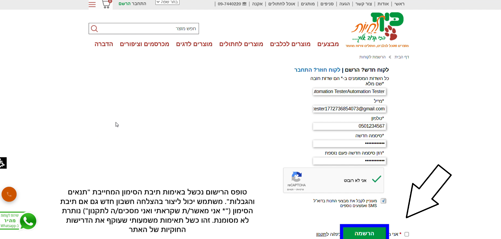

***

Bug-07: Data Integrity Failure - Duplicate Phone Number Registration
Severity: Critical

Feature: User Management / Database Validation

Description:
The system allows multiple user accounts to be registered using the exact same phone number. Since a phone number is a unique identifier, this leads to data inconsistency and potential security issues where account recovery or identification might fail.

Steps to Reproduce:

Register a new user with a specific phone number (e.g., 050-1234567) and complete the process.

Log out.

Attempt to register a second, different user (different name and email) using the same phone number (050-1234567).

Click the "Register" button.

Actual Result:
The system accepts the registration and creates a second account with the duplicate phone number.

Expected Result:
The system should prevent the registration and display an error message stating: "This phone number is already registered" (מספר טלפון זה כבר קיים במערכת).

Visual Evidence:
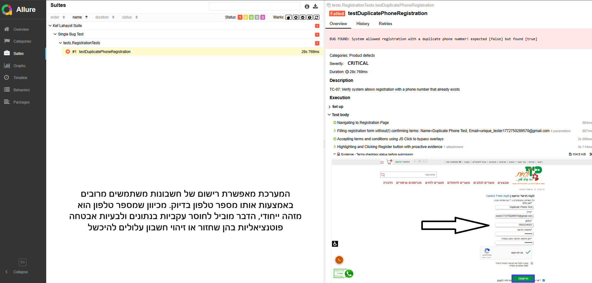

***

Bug-08: Poor Accessibility - Low Contrast Between Text and Background
Severity: Minor

Feature: Footer / Newsletter Subscription

Description:
In the "About Us" page footer, within the newsletter subscription section, the text "אני מאשר/ת שקראתי ואני מסכימ/ה לתקנון" (I agree to the terms) is displayed in a color that lacks sufficient contrast against the background image. This makes the text nearly invisible and unreadable for many users.

Steps to Reproduce:

Navigate to the "About Us" (אודות) page.

Scroll to the bottom of the page to the newsletter signup section.

Observe the legal confirmation text next to the checkbox.

Actual Result:
The text color blends into the background image, failing accessibility standards (WCAG) for text legibility.

Expected Result:
The text should have a high-contrast color (e.g., solid black or white depending on the background) or be placed on a semi-opaque background layer to ensure it is clearly legible.

Visual Evidence:
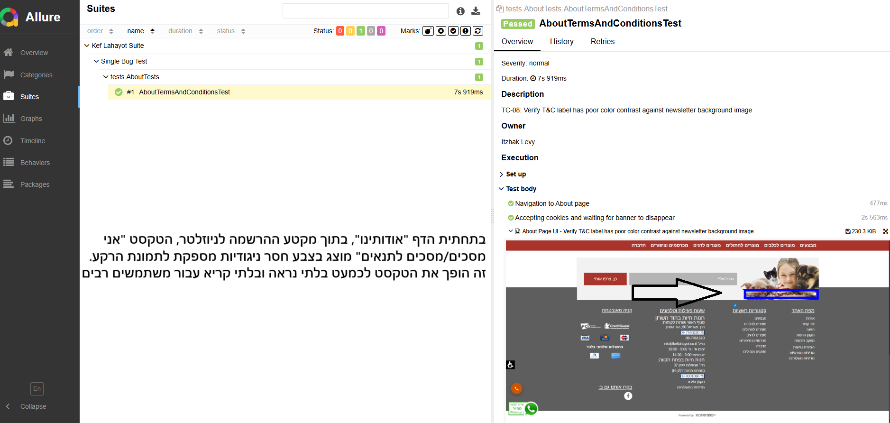

***

Bug-09: RTL Layout Issue - Mandatory Asterisk Misplacement
Severity: Trivial

Feature: Newsletter Subscription / UI Layout

Description:
In the newsletter subscription section, the mandatory asterisk for the email field ("המייל שלי:") is positioned incorrectly. In Hebrew (RTL), the asterisk should appear to the right of the label to maintain correct grammatical and visual alignment for mandatory fields.

Steps to Reproduce:

Navigate to the footer of the "About Us" page.

Locate the "Email" input field in the newsletter section.

Observe the position of the red asterisk relative to the text "המייל שלי".

Actual Result:
The asterisk is placed on the left side of the text, which is inconsistent with standard RTL (Right-to-Left) UI patterns.

Expected Result:
The asterisk should be placed to the right of the label (e.g., "*:המייל שלי") to ensure it is the first thing a Hebrew-speaking user sees, following standard RTL form design.

Visual Evidence:
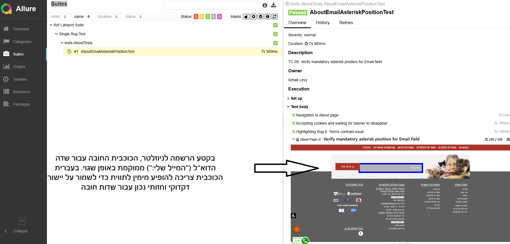

***

Bug-10: UI Clipping - Newsletter Consent Text Obstructed
Severity: Normal

Feature: Newsletter Subscription / UI Integrity

Description:
The text span "מאשר קבלת הטבות ומבצעים למייל שלי" (Confirming receipt of benefits and deals) and its associated checkbox are largely hidden within the newsletter section. Only the checkbox itself is partially visible, while the descriptive text is clipped by the container boundaries, leaving the user unaware of what they are consenting to.

Steps to Reproduce:

Navigate to the footer of the "About Us" (אודות) page.

Locate the newsletter subscription area.

Observe the checkbox and text regarding promotional emails.

Actual Result:
The text is cut off and invisible, with only the checkbox element peeking through the layout.

Expected Result:
The container should be sized appropriately (or line-height/padding adjusted) to ensure that both the checkbox and the full descriptive text are clearly visible and legible.

Visual Evidence:
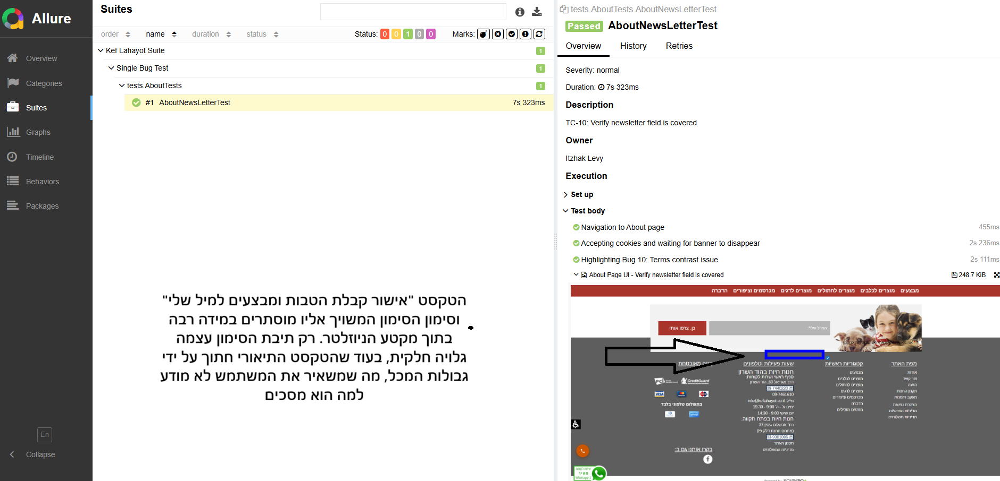

***

Bug-11: Element Overlap - Captcha Widget Obstructs Legal Links
Severity: Normal

Feature: Contact Us Page / UI Integrity

Description:
On the "Contact Us" page, the Google ReCaptcha widget is incorrectly positioned, causing it to overlap with the footer links for "Terms and Conditions" (תקנון האתר) and "Shipping Policy" (מדיניות המשלוחים).

Steps to Reproduce:

Navigate to the "Contact Us" (צור קשר) page: https://www.keflahayot.co.il/pages/contact-us.

Scroll to the bottom of the contact form where the Captcha is located.

Observe the positioning of the Captcha badge relative to the text links beside it.

Actual Result:
The Captcha element partially floats over the text, making the links underneath partially unclickable.

Expected Result:
The layout should provide enough vertical spacing (margin/padding) between the form elements (including the Captcha) and the footer links to ensure no overlap occurs.

Visual Evidence:
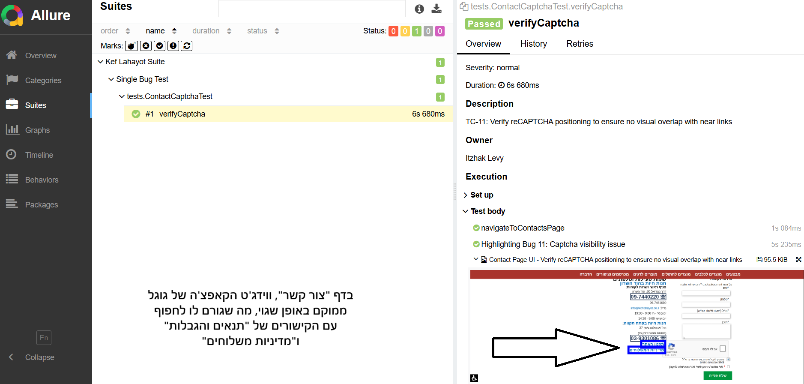

***

Bug-12: Content Rendering Failure - Large Empty Container on "Arrival" Page
Severity: Critical

Feature: Location & Arrival Page / Content Display

Description:
On the "Arrival" (הגעה) page, clicking the link "חנות חיות בפתח תקווה >>" redirects the user to a page that contains a massive empty gray rectangle instead of the expected content (such as a map, address, or store details). While the header and footer load correctly, the main content area fails to render.

Steps to Reproduce:

Navigate to the "Arrival" page or go directly to: https://www.keflahayot.co.il/pages/22898-petahtikva.

Observe the main body of the page below the header.

Identify the large gray placeholder/container.

Actual Result:
The central part of the page is a large, empty gray box with no text, images, or interactive maps.

Expected Result:
The page should display the relevant store information, embedded Google Map, or at least a "Content Loading" state if the data is being fetched from an external source.

Visual Evidence:
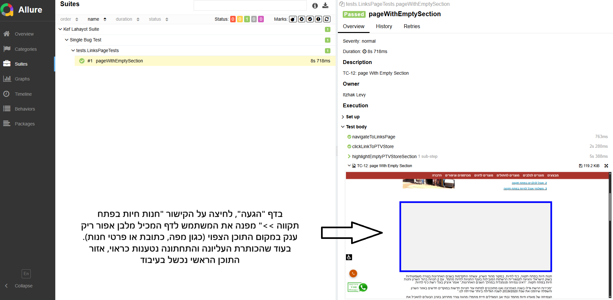

***

Bug-13: Severe Typography Issue - Overlapping Text on Shipping Policy Page
Severity: Normal

Feature: Shipping Policy / Content Legibility

Description:
On the "Shipping" (משלוחים) page, the text blocks describing delivery areas and terms suffer from a critical layout failure. The lines of text are vertically collapsed and overlap each other, making the entire policy document nearly impossible to read for the end-user.

Steps to Reproduce:

Navigate to the Shipping Policy page: https://www.keflahayot.co.il/pages/38760-משלוחים.

Scroll through the page content, specifically the sections for "Area A" and "Area B".

Observe the vertical spacing between the lines of Hebrew text.

Actual Result:
The line-height or margin properties are insufficient, causing the bottom of one line to overlap with the top of the next line throughout the page.

Expected Result:
The text should have proper vertical spacing (e.g., line-height: 1.5) and clear paragraph breaks to ensure the shipping terms are professional and easy to read.

Visual Evidence:
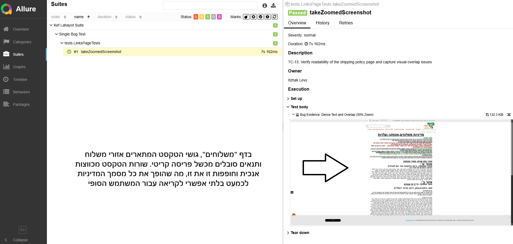

